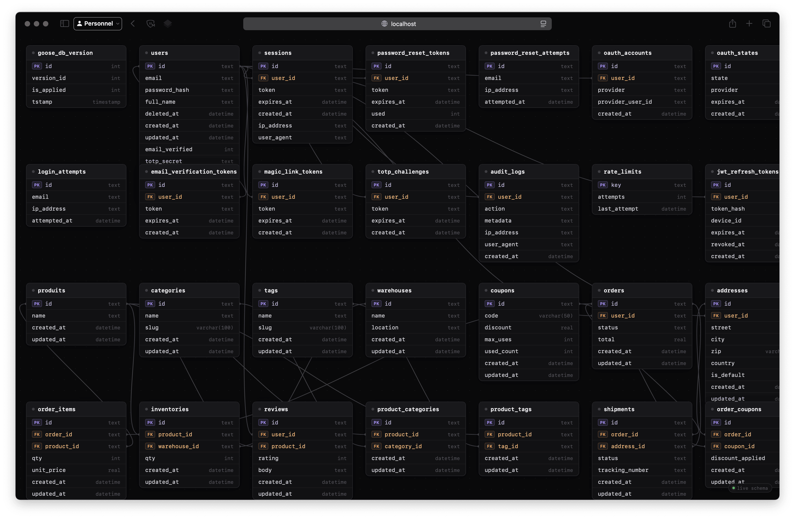
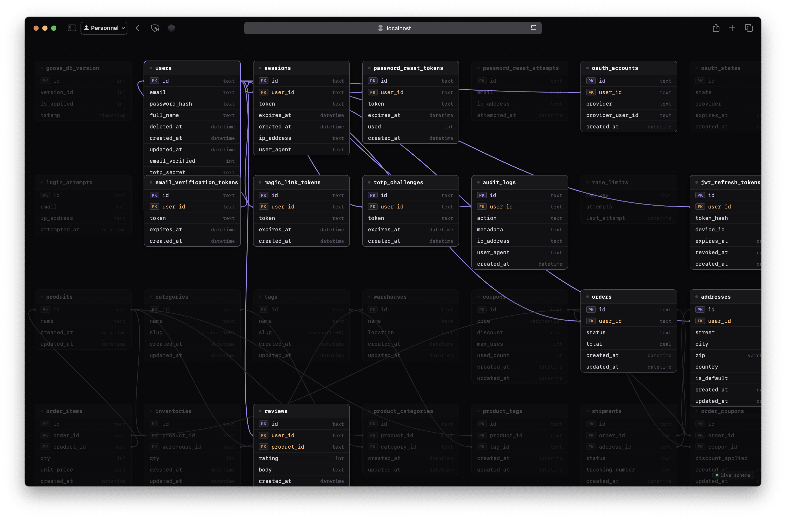
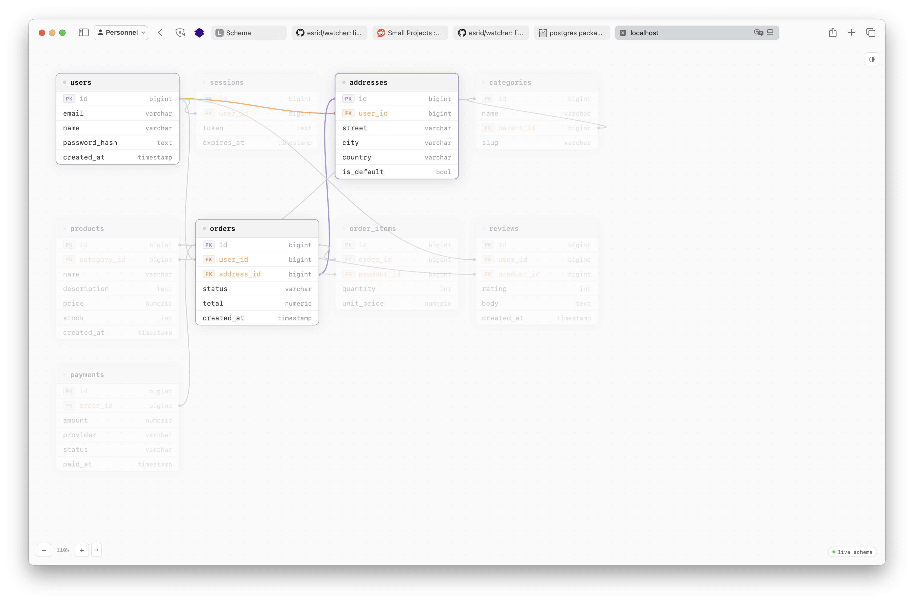

# DB Watcher

[](https://go.dev/)
[](./LICENSE)
[](https://pkg.go.dev/github.com/esrid/watcher)

**DB Watcher** is a lightweight, zero-dependency schema introspection library for Go. Mount a real-time, interactive database schema dashboard directly onto your existing web application in seconds.

<div align="center">
  <table>
    <tr>
      <td align="center"></td>
      <td align="center"></td>
      <td align="center"></td>
    </tr>
    <tr>
      <td align="center"><sub>Dashboard</sub></td>
      <td align="center"><sub>Relationship Highlighting</sub></td>
      <td align="center"><sub>Light &amp; Dark Mode</sub></td>
    </tr>
  </table>
</div>

---

## Features

- **Multi-driver support** — SQLite (`go-sqlite3`, `modernc.org/sqlite`), PostgreSQL (`lib/pq`, `pgx/v5`), MySQL/MariaDB (`go-sql-driver/mysql`). Instrumented wrappers (e.g. `otelsql`) are automatically unwrapped.
- **Rich schema introspection** — tables, columns with full constraint metadata (`NOT NULL`, `DEFAULT`, `UNIQUE`), foreign keys, and indexes (unique, composite, partial).
- **Schema diffing** — take snapshots over time and compute diffs (added/dropped tables, type changes, index changes).
- **Real-time dashboard** — the browser polls the backend and updates the ERD without a page reload.
- **Interactive ERD** — drag tables, click to highlight relationships with animated flow paths, double-click to collapse cards.
- **Global search** — floating search bar (`⌘K` or `/`) to instantly filter tables by name.
- **Persistent layout** — drag positions and collapsed card states survive page reloads via `localStorage`.
- **Light & Dark mode** — follows OS preference, togglable, persisted in `localStorage`.
- **Polymorphic handler** — same endpoint serves the HTML dashboard or raw JSON (`?format=json` / `Accept: application/json`).

---

## Getting Started

### Install

```bash
go get github.com/esrid/watcher
```

### Quick example

```go
package main

import (
    "database/sql"
    "fmt"
    "net/http"

    "github.com/esrid/watcher"
    _ "github.com/mattn/go-sqlite3"
)

func main() {
    db, err := sql.Open("sqlite3", "app.db")
    if err != nil {
        panic(err)
    }
    defer db.Close()

    inspector, err := watcher.NewInspector(db)
    if err != nil {
        panic(err)
    }

    http.HandleFunc("/_debug/schema", watcher.HTTPHandler(inspector))

    fmt.Println("Dashboard at http://localhost:8080/_debug/schema")
    http.ListenAndServe(":8080", nil)
}
```

### Schema diffing example

```go
d := watcher.NewDiffer(inspector)

// Seed the first snapshot at startup.
if _, err := d.Snapshot(context.Background()); err != nil {
    panic(err)
}

http.HandleFunc("/_debug/schema",         watcher.HTTPHandler(inspector))
http.HandleFunc("/_debug/schema/changes", watcher.ChangesHandler(d))

// POST /_debug/schema/changes  →  take a new snapshot, return the diff
// GET  /_debug/schema/changes  →  return the latest diff (no snapshot)
```

---

## API Reference

### `NewInspector`

```go
func NewInspector(db *sql.DB) (Inspector, error)
```

Detects the underlying driver and returns the matching `Inspector` implementation. Supported drivers:

| Driver | Package |
|--------|---------|
| `*sqlite3.SQLiteDriver` | `github.com/mattn/go-sqlite3` |
| `*sqlite.Driver` | `modernc.org/sqlite` |
| `*pq.Driver` | `github.com/lib/pq` |
| `*stdlib.Driver` | `github.com/jackc/pgx/v5/stdlib` |
| `*mysql.MySQLDriver` | `github.com/go-sql-driver/mysql` |

Instrumented wrappers that implement `Unwrap() driver.Driver` are resolved automatically. Unknown wrappers fall back to dialect probing.

### `Inspector`

```go
type Inspector interface {
    Tables(ctx context.Context) ([]string, error)
    Columns(ctx context.Context, tableName string) ([]string, error)
    Relations(ctx context.Context, tableName string) ([]string, error)
    Indexes(ctx context.Context, tableName string) ([]Index, error)
    ColumnMeta(ctx context.Context, tableName string) ([]ColumnMeta, error)
}
```

- `Tables` — returns all user-defined table names.
- `Columns` — returns `"name|type|pk"` descriptors (legacy; prefer `ColumnMeta`).
- `Relations` — returns `"fromCol -> targetTable.targetCol"` descriptors.
- `Indexes` — returns all non-primary indexes for a table.
- `ColumnMeta` — returns full column metadata including constraints.

### `Index`

```go
type Index struct {
    Name    string   `json:"name"`
    Unique  bool     `json:"unique"`
    Columns []string `json:"columns"` // in key order
    Partial bool     `json:"partial"` // true when a WHERE predicate exists
}
```

### `ColumnMeta`

```go
type ColumnMeta struct {
    Name    string `json:"name"`
    Type    string `json:"type"`
    PK      bool   `json:"pk"`
    FK      bool   `json:"fk"`      // set by HTTPHandler from Relations()
    NotNull bool   `json:"notNull"`
    Default string `json:"default"` // empty = no explicit default
    Unique  bool   `json:"unique"`
}
```

### `HTTPHandler`

```go
func HTTPHandler(inspector Inspector) http.HandlerFunc
```

Serves the interactive HTML dashboard or, when requested with `?format=json` or `Accept: application/json`, the raw JSON payload:

```json
{
  "tables": [
    {
      "name": "users",
      "cols": [
        {"name": "id",    "type": "int",     "pk": true,  "fk": false, "notNull": true,  "default": "",      "unique": false},
        {"name": "email", "type": "varchar",  "pk": false, "fk": false, "notNull": true,  "default": "",      "unique": true},
        {"name": "bio",   "type": "text",     "pk": false, "fk": false, "notNull": false, "default": "",      "unique": false},
        {"name": "score", "type": "numeric",  "pk": false, "fk": false, "notNull": true,  "default": "0.00",  "unique": false}
      ],
      "indexes": [
        {"name": "idx_users_email",   "unique": true,  "columns": ["email"],      "partial": false},
        {"name": "idx_active_users",  "unique": false, "columns": ["created_at"], "partial": true}
      ]
    }
  ],
  "relations": [
    {"src": "orders", "srcCol": "user_id", "tgt": "users", "tgtCol": "id"}
  ]
}
```

### `NewDiffer` / `ChangesHandler`

```go
func NewDiffer(inspector Inspector) *Differ
func (d *Differ) Snapshot(ctx context.Context) (SchemaSnapshot, error)
func (d *Differ) Diff() (SchemaDiff, bool)
func ChangesHandler(d *Differ) http.HandlerFunc
```

`Differ` stores the two most recent snapshots and computes the diff between them.

`ChangesHandler` exposes the diff over HTTP:

- `POST` — takes a new snapshot, then returns the resulting `SchemaDiff` as JSON.
- `GET` — returns the latest `SchemaDiff` without taking a snapshot. Returns `{}` if fewer than two snapshots exist.

`SchemaDiff` shape:

```json
{
  "before": "2024-01-01T00:00:00Z",
  "after":  "2024-01-02T00:00:00Z",
  "addedTables":   ["audit_logs"],
  "droppedTables": [],
  "modified": [
    {
      "table":          "users",
      "addedColumns":   ["deleted_at"],
      "droppedColumns": [],
      "typeChanges":    [{"column": "score", "before": "int", "after": "numeric"}],
      "addedIndexes":   ["idx_users_deleted_at"],
      "droppedIndexes": []
    }
  ]
}
```

---

## Testing

DB Watcher uses [Testcontainers for Go](https://golang.testcontainers.org/) for integration tests against real PostgreSQL and MySQL instances.

```bash
# Unit tests only
go test ./...

# Full integration tests (requires Docker)
go test -tags=integration -v ./...
```

---

## License

MIT — see [LICENSE](LICENSE).
