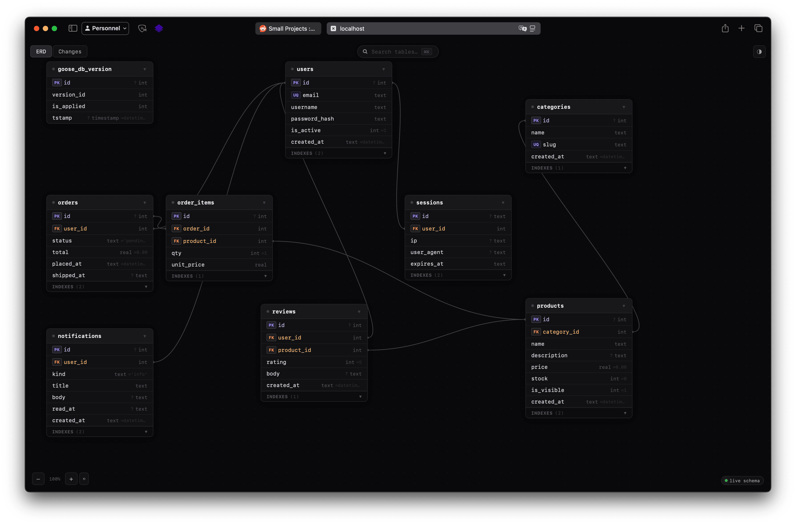
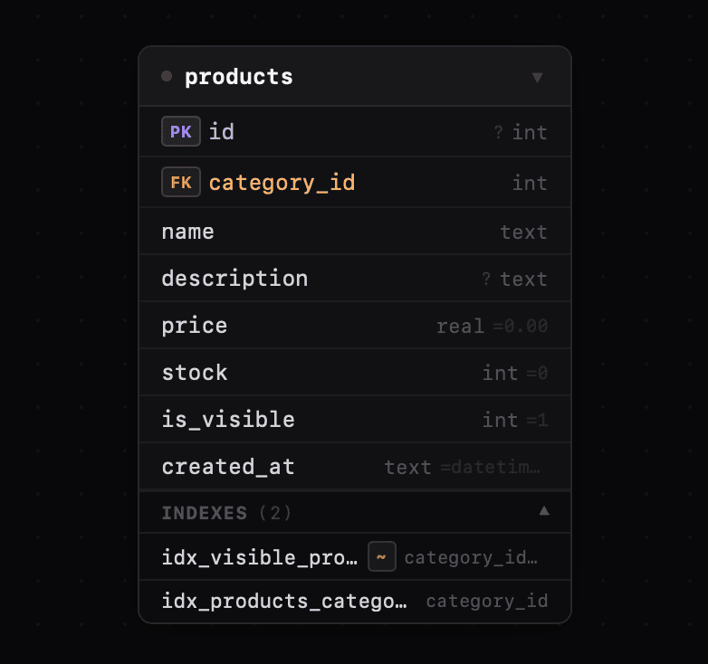
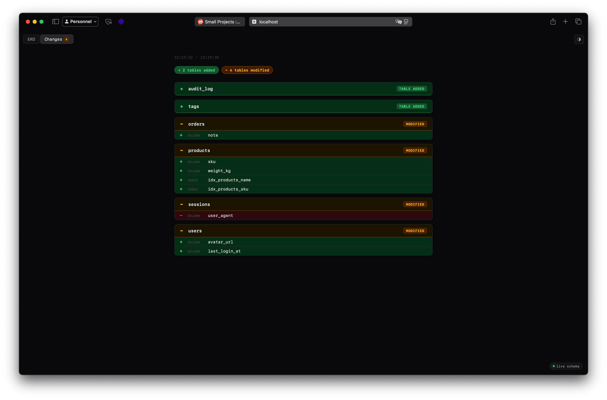

# DB Watcher

[](https://go.dev/)
[](./LICENSE)
[](https://pkg.go.dev/github.com/esrid/watcher)

**DB Watcher** is a lightweight, zero-dependency schema introspection library for Go. Mount a real-time, interactive database schema dashboard directly onto your existing web application in seconds.

<div align="center">
  <table>
    <tr>
      <td align="center"></td>
      <td align="center"></td>
      <td align="center"></td>
    </tr>
    <tr>
      <td align="center"><sub>ERD Dashboard</sub></td>
      <td align="center"><sub>Table Detail</sub></td>
      <td align="center"><sub>Schema Changes</sub></td>
    </tr>
  </table>
</div>

---

## Features

- **Multi-driver support** — SQLite (`go-sqlite3`, `modernc.org/sqlite`), PostgreSQL (`lib/pq`, `pgx/v5`), MySQL/MariaDB (`go-sql-driver/mysql`). Instrumented wrappers (e.g. `otelsql`) are automatically unwrapped.
- **Rich schema introspection** — tables, columns with full constraint metadata (`NOT NULL`, `DEFAULT`, `UNIQUE`), foreign keys, and indexes (unique, composite, partial).
- **Interactive ERD** — drag tables, click to highlight relationships with animated flow paths, double-click to collapse cards.
- **Schema changes view** — built into the same UI, shows added/dropped tables, column and index changes between snapshots. Persists the last non-empty diff so you don't miss it.
- **Global search** — floating search bar (`⌘K` or `/`) filters tables by name, persists after closing.
- **Persistent layout** — drag positions and collapsed states survive page reloads via `localStorage`.
- **Light & Dark mode** — follows OS preference, togglable, persisted in `localStorage`.
- **JSON API** — same endpoint serves the HTML dashboard or raw JSON (`?format=json` / `Accept: application/json`).

---

## Getting Started

```bash
go get github.com/esrid/watcher
```

```go
package main

import (
    "context"
    "database/sql"
    "fmt"
    "net/http"
    "time"

    "github.com/esrid/watcher"
    _ "github.com/mattn/go-sqlite3"
)

func main() {
    db, err := sql.Open("sqlite3", "app.db")
    if err != nil {
        panic(err)
    }
    defer db.Close()

    inspector, err := watcher.NewInspector(db)
    if err != nil {
        panic(err)
    }

    // Optional: enable the Changes tab
    differ := watcher.NewDiffer(inspector)
    if _, err := differ.Snapshot(context.Background()); err != nil {
        panic(err)
    }
    differ.Watch(context.Background(), 5*time.Second, func(err error) {
        log.Println("snapshot error:", err)
    })

    http.HandleFunc("/_schema",         watcher.HTTPHandler(inspector))
    http.HandleFunc("/_schema/changes", watcher.ChangesHandler(differ))

    fmt.Println("Dashboard → http://localhost:8080/_schema")
    http.ListenAndServe(":8080", nil)
}
```

---

## API Reference

### `NewInspector`

```go
func NewInspector(db *sql.DB) (Inspector, error)
```

Detects the underlying driver and returns the matching `Inspector` implementation.

| Driver | Package |
|--------|---------|
| `*sqlite3.SQLiteDriver` | `github.com/mattn/go-sqlite3` |
| `*sqlite.Driver` | `modernc.org/sqlite` |
| `*pq.Driver` | `github.com/lib/pq` |
| `*stdlib.Driver` | `github.com/jackc/pgx/v5/stdlib` |
| `*mysql.MySQLDriver` | `github.com/go-sql-driver/mysql` |

Instrumented wrappers that implement `Unwrap() driver.Driver` are resolved automatically. Unknown wrappers fall back to dialect probing.

### `Inspector`

```go
type Inspector interface {
    Tables(ctx context.Context) ([]string, error)
    Columns(ctx context.Context, tableName string) ([]string, error)
    Relations(ctx context.Context, tableName string) ([]string, error)
    Indexes(ctx context.Context, tableName string) ([]Index, error)
    ColumnMeta(ctx context.Context, tableName string) ([]ColumnMeta, error)
}
```

### `Index`

```go
type Index struct {
    Name    string   `json:"name"`
    Unique  bool     `json:"unique"`
    Columns []string `json:"columns"` // in key order
    Partial bool     `json:"partial"` // true when a WHERE predicate exists
}
```

### `ColumnMeta`

```go
type ColumnMeta struct {
    Name    string `json:"name"`
    Type    string `json:"type"`
    PK      bool   `json:"pk"`
    FK      bool   `json:"fk"`
    NotNull bool   `json:"notNull"`
    Default string `json:"default"` // empty = no explicit default
    Unique  bool   `json:"unique"`
}
```

### `HTTPHandler`

```go
func HTTPHandler(inspector Inspector) http.HandlerFunc
```

Serves the interactive ERD dashboard. When requested with `?format=json` or `Accept: application/json`, returns the raw JSON payload:

```json
{
  "tables": [
    {
      "name": "users",
      "cols": [
        {"name": "id",    "type": "int",    "pk": true,  "fk": false, "notNull": true,  "default": "",     "unique": false},
        {"name": "email", "type": "varchar", "pk": false, "fk": false, "notNull": true,  "default": "",     "unique": true}
      ],
      "indexes": [
        {"name": "idx_active_users", "unique": false, "columns": ["created_at"], "partial": true}
      ]
    }
  ],
  "relations": [
    {"src": "orders", "srcCol": "user_id", "tgt": "users", "tgtCol": "id"}
  ]
}
```

### `NewDiffer` / `Watch` / `ChangesHandler`

```go
func NewDiffer(inspector Inspector) *Differ
func (d *Differ) Snapshot(ctx context.Context) (SchemaSnapshot, error)
func (d *Differ) Watch(ctx context.Context, interval time.Duration, onErr func(error))
func (d *Differ) Diff() (SchemaDiff, bool)
func ChangesHandler(d *Differ) http.HandlerFunc
```

`Differ` tracks schema snapshots and exposes the diff between the last two. It persists the last non-empty diff — if the schema stabilizes after a migration, the changes remain visible until a new migration produces a fresh diff.

`Watch` takes snapshots in the background on every tick until the context is cancelled.

`ChangesHandler` exposes diffs over HTTP (JSON only):

- `GET` — returns the latest `SchemaDiff`. Returns `{}` if fewer than two snapshots exist.
- `POST` — takes a new snapshot, then returns the resulting diff.

```json
{
  "before": "2024-01-01T00:00:00Z",
  "after":  "2024-01-02T00:00:00Z",
  "addedTables":   ["audit_log"],
  "droppedTables": [],
  "modified": [
    {
      "table":          "users",
      "addedColumns":   ["deleted_at"],
      "droppedColumns": [],
      "typeChanges":    [{"column": "score", "before": "int", "after": "numeric"}],
      "addedIndexes":   ["idx_users_deleted_at"],
      "droppedIndexes": []
    }
  ]
}
```

---

## Testing

Integration tests require Docker (Testcontainers).

```bash
# Unit tests only
go test ./...

# Full integration tests (requires Docker)
go test -tags=integration -v ./...
```

---

## License

MIT — see [LICENSE](LICENSE).
